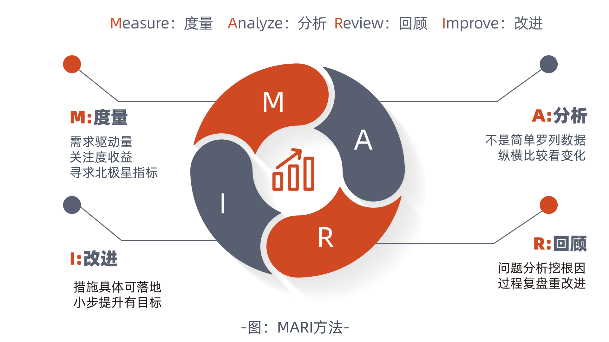

# MARI指南简介

MARI 是一套面向软件研发，应用于效能度量及实践落地的方法论。

MARI 的目的是建立效能度量和改进的闭环。研发团队结合实际情况，将价值流中的关键阻碍问题定位为提升点后，可以应用 MARI 方法论，对问题进行量化评估、分析和拆解，获取效能瓶颈、改进机会等洞见，进而落地为软件工程实践的逐步优化，以及切实的效能提升。

MARI 由以下四个步骤组成，这四个步骤共同组成一轮完整的优化迭代。大部分情况下，问题改进需要经历多个迭代，持续度量改进效果，不断校准改进的方向和方法。

## **度量 Measure**

无论任何改进活动，首先需结合组织及团队实际认知需求，面向改进目标通过量化数据对过程及目标进行刻画，即建立**度量**。度量需要统一数据及指标的采集方法。

## **分析 Analyze**

有了量化指标，运用统计分析方法，对数据的趋势、分布、关联等信息进行**分析**，得到对现状的量化理解。

## **回顾 Review**

基于分析结果，对产生“果”（结果）的“因”（影响因子），进行**回顾**，挖掘对结果产生影响的根本原因，定位关键问题。

## **改进 Improve**

针对关键问题，建立可落地的**改进**措施，通过调整“因”（影响因子），最终影响“果”（目标）的达成，并进入下一轮度量验证。

