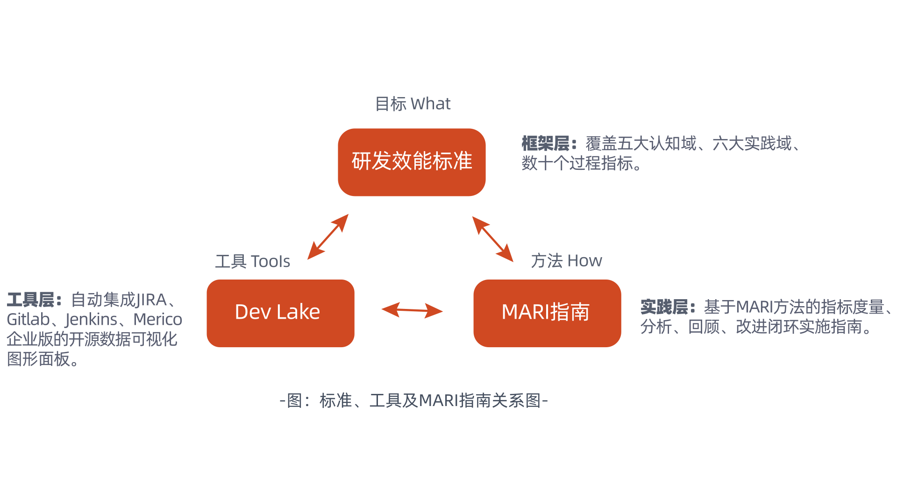

# 背景

MARI 在《软件研发效能度量规范》团体标准的框架下制定，沿袭了框架的多维度量原则，指标面向交付价值、交付速率、交付质量、交付成本、交付能力五大认知域，覆盖需求、设计、开发、测试、发布、运营六大实践域，并根据不同角色在不同场景下的认知需求，对同一指标设计了多种分析、回顾和改进方法。

MARI 实践方法论以外，开源的研发数据平台 [Dev Lake](https://github.com/merico-dev/lake) 能够作为自动化的数据采集及可视化工具，应用于其中的 [M（Measure度量）](../#du-liang-measure)与 [A（Analyze分析）](../#fen-xi-analyze)环节，帮助研发团队低成本实现实时、跨数据源的度量，为后续更进一步的回顾和改进提供数据支撑。MARI 与 Dev Lake 共同支持了研发效能度量框架的落地。

