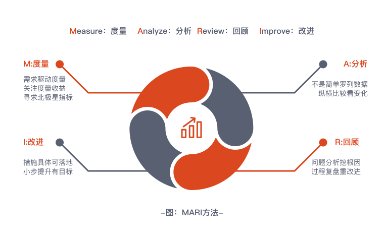

# 开源指标体系和效能改进指南

:::info
OpenMARI 是一套适用于软件研发效能度量和数据分析的指标体系，以及相应的研发效能改进方法。其内容遵循**开源协议**和**知识共享许可**。

目前正在建设中，**欢迎行业专家和开发者共建！**——点击页末编辑按钮，或访问右上角GitHub链接，提交您的意见和建议，输出行业影响力！
:::

MARI 方法论的目的是建立从效能度量到改进的闭环。研发团队可结合自身实际情况，定位效能改进的目标，并采用 MARI 方法论，对目标的具体问题选取度量指标，进行数据分析，获得效能瓶颈、改进机会等洞见，进而落地为研发过程的逐步优化，让每位开发者打造并享受卓越的软件工程实践。

MARI 由以下四个步骤组成，这四个步骤共同组成一轮完整的优化迭代。大部分情况下，软件工程实践的改进需要经历多个迭代，通过持续度量和分析，不断校准改进的方向和方法。

## **度量 Measure**

软件研发是一个复杂的过程，需要通过数据和度量建立更完整的认知，就像通过分析日志来定位一个复杂分布式系统中的问题。无论任何改进活动，首先需结合研发团队的认知需要，面向改进目标选取指标，按照规范的方法，收集数据并进行计算。

## **分析 Analyze**

有了数据和度量，需要运用统计学的分析方法，采用特定的数学模型，对指标的趋势、分布、关联等信息进行分析，得到对现状的量化理解，并尽量深入获得对问题的洞察。

## **回顾 Review**

分析结果并不能替代人的判断，数据分析应当是对管理认知的辅助。这一阶段需要人的输入，通过会议或调研等方式，对产生结果的影响因子进行回顾，确认或挖掘对结果产生影响的根本原因，定位关键的改进项。

## **改进 Improve**

针对关键的改进项，建立可落地的改进措施。通过调整这些影响因子，最终影响结果，达成研发改进目标，并进入下一轮度量验证。
