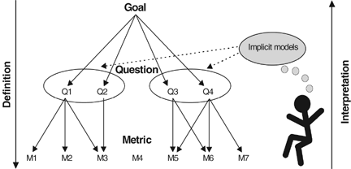

目标-问题-指标（GQM）是软件工程领域的一套系统方法，被称为研发效能度量方法的“事实标准”。
通过系统化的数据度量和分析，我们可以更好地认知软件研发过程和产物，为研发团队提供及时反馈，优化研发流程，提升研发效能，为开发者带来卓越的软件工程实践。
但目前产业界对 GQM 的应用存在两方面的误区：
一是简单从字面理解“目标”、“问题”和“指标”的概念，没有进一步理解它们的具体定义和背后的模型等精髓；
二是尚未充分意识到 GQM 是构建研发效能度量体系的一种根本性方法。

今天我们看到很多关于研发效能度量的文章、演讲、案例和书籍。
它们分享了实践中宝贵的第一手经验，但各家指标纷繁、模式各异，研发效能实践者难免会感到无所适从。
GQM 为我们提供了抓住本质、化繁为简的有效路径。
本文将分享我们对早期和经典 GQM 模式的评论，并为读者提供一套现代 GQM 实践指南。

<!--truncate-->

## GQM 起源

GQM 最早由 Basili 提出[^Basili(1984)]，发表在软件工程领域权威期刊 IEEE Transactions on Software Engineering 上。
GQM 当初是为软件工程研究中的**数据收集和分析**而设计的，**基本思想**是：
- 数据的收集和分析一定要聚焦于清晰具体的目标，每个目标划归为一组可量化回答的问题，每个问题通过若干特定的指标来回答。
- 依据指标收集到的数据，通过分析产生对问题的回答，进而达成定义的目标。

实际上，我们今天所讨论的研发效能度量，可以看作软件工程研究领域数据收集和分析的“低配版”。
软件工程研究通常需要生产环境中的数据来评价软件开发方法和认知软件开发过程，会采用 GQM 这样系统的方法，保证具体实施的科学性和严谨性。
实用目的下的研发效能度量，不必过度追求科学性和严谨性，但现实中往往因为一些随意乃至混乱的做法，获得无效的数据或误导的结论。
采用 GQM 方法，可以帮助我们实行真正有意义的研发效能度量。
我们先追本溯源，概览早期 GQM 的实施步骤。

### 早期步骤设计和参考意义 {#early-gqm}

> 效率是“以正确的方式做事”，而效能是“做正确的事”。
>
> ——彼得·德鲁克《有效的管理者》

GQM 包含如下六个基本步骤，其中最费时费力的一些步骤（标记了“*”）在今天已经因为流程工具的普及而变得非常便利。
正是因为这样数据收集成本的极大降低，让研发效能度量变得普遍可行和实用。
与此同时，其他 GQM 步骤侧重概念层面的思考和梳理，并不会给团队带来很大成本，却至关重要，能够保证整个过程在“做正确的事”。
它们在今天的研发效能度量实践中经常被忽视，得不偿失。

1. **确立数据收集的目标**。
目标通常分为两类，一类用于评价特定的软件开发方法，另一类独立于特定软件开发方法，用于认知软件研发过程或产出。
在研发效能度量实践中，评价改进措施的有效性即为前者，如 MARI 方法[^OpenMARI]中实施改进后的再次度量验证。
后者并不以评价为目的，而是对研发过程或产出在某些维度上进行刻画。
目标更完备的定义方法参见[经典模型](#classic-gqm)或[最新的实践](#modern-gqm)。

2. **列出感兴趣的问题**。
问题是主观设立的目标和量化度量之间的桥梁。
例如，对于“评价软件进行修改的难易程度”这个目标，问题可以包含“多少代码修改只限于单一模块”。
这些问题通常会决定最终数据的分类或参数。
例如，“代码修改在各个系统模块的分布如何”意味着代码提交的数据应按照系统模块进行分类。

3. **确立数据的分类**。
通常每个问题可以引出对数据的一种具体分类。
分类应不重不漏，作为下一步设计数据收集表格的依据。
在今天的研发效能度量实践中，这些分类可作为研发数据治理或数据规范的依据。

4. ***设计和测试数据收集表格**。
需要开发者在提交代码修改时手动填写数据收集表格。
这是早期时代的产物。
今天业界已经广泛使用研发流程工具（最具代表性的就是 Jira），大部分数据可以在流程运转过程中方便地存留或填入，如事物或缺陷的分类，不再需要单独的数据收集表格和额外步骤。
所以流程工具的普及和自然的信息存留，为研发效能向数据驱动的方向发展提供了现实基础。

5. ***收集和验证数据**。
数据表格如果发现问题，需要与填表人进行访谈，
这种安排在今天或许也可借鉴，比如事务填写预估的故事点，如果通过代码当量等进行校准时发现较大偏差，就值得在迭代回顾会上讨论偏差的原因，逐步提升团队预估故事点的准确性。

6. **分析数据**。
当时所说的数据分析局限在根据问题计算数据的参数和分布。
今天可以采用的分析方法更加多样，比如同比、环比对比，依赖比当时更多更丰富的可用数据。

## 理解经典 GQM {#classic-gqm}

GQM 方法提出后，经过了不断的丰富和发展，早期即应用在 NASA、惠普、普华永道、斯伦贝谢、西门子、爱立信、飞利浦、博世、戴姆勒-克莱斯勒、安联、宝洁等各行业先进企业，相关文献和引用比较丰富。
其中，Basili 在马里兰大学的技术报告[^Basili(1992)]和 2002 年与其他人合作的文章[^vanSolingen(2002)]是对经典 GQM 较为成熟和完整的阐述，推荐读者参考。
前者适合有研究背景的读者，但其表达和格式上存在一些不足之处，可能影响阅读和理解；后者适合行业中更广泛的读者，但其某些裁剪和简化容易误导实践，下面会逐一指出。
本文综合这两篇和其他文献的主要内容，将经典 GQM 的精华进行了提炼和总结。

### 整体框架

通过 GQM 雏形的主要[实操步骤](#early-gqm)，我们对该方法已经建立了初步的认知。图 1 展示了方法的整体框架。

图 1 - GQM 框架[^vanSolingen(2002)]

这里面需要特别提出的关键概念是**模型**。
问题本质上是一种定义模型的方法。
这个模型可以是显式的数学模型，也可以是通过问题反映出的在专家头脑中的隐式模型。
GQM 强调有效的研发效能度量必须：
- 以自上而下的方式定义，聚焦于特定目标；
- 应用于研发产物、过程和资源的全周期；
- 基于数据刻画，面向目标，自下而上进行解读。

### 概念层：目标

目标以通用术语表达组织的信息需要。其定义包括如下部分：
- **对象**（objective）：通常为研发的产物（如代码、文档、测试用例、制品等）、过程（如需求分析、设计、测试等）或资源（如人员、硬件等）。
- **目的**（purpose）：刻画、了解、评价、预测、改进等。
- **维度**（perspective）：成本、缺陷、及时性、准确性、可靠性、性能、用户满意度等。
- **视角**（viewpoint）：用户、开发者、管理者、公司等。
- 环境（environment）：度量的上下文，包括人员构成、研发模式、编程语言等，用于判断度量间的可比性。

GQM 面向度量目标，与改进目标有所区分[^vanSolingen(2002)]。
度量为改进行动提供所需信息，即哪里需要改进和如何进行改进。
但实际上，组织最终关心的还是改进目标，度量目标应为改进目标服务。
所以，我们更赞成将改进视作目标的一种目的[^Basili(1992)]，而改进目标到度量目标的转化可包含在问题和模型中。

视角有一层含义在于区分数据范围，例如项目经理需要及时的进度反馈，而公司可以接受更长时间范围的评价[^vanSolingen(2002)]。
今天数据极大丰富，又支持快速自动分析，这种区分对后续度量的影响不大，所以视角的主要含义还是不同**角色**关注不同的目标。

另外，环境这个参数在相关文献中较少展开论述，通常只是由目标项目或团队指代。
它在今天研发效能度量中的主要意义是支持对比，不论组织内部，还是同行之间，多用于以评价为目的的目标。
我们推荐在实践中简化目标定义，不必每一个目标都包含环境要素，只在需要度量间对比时进行定义。

下面我们给出一个目标实例，其自然表述可以拆分出如上各个参数。

<a name="goal-example">表 1</a> - 目标定义实例

| 自然表述 | 项目经理关注的目标：改进代码修改请求处理的及时性 |
|---|---|
| 目的 | 改进 |
| 对象 | 代码修改请求处理的过程 |
| 维度 | 及时性 |
| 视角 | 项目经理 |

### 操作层：问题

根据目标提出的一系列问题，主要用于刻画目标[^vanSolingen(2002)]，其中隐含着一个在目标维度上刻画目标对象的模型。

#### 刻画模型

我们通过一个实例来具体理解“刻画”的含义和常见方式。

<a name="reliability-questions">表 2</a> - 关于可靠性的问题列表实例

| 目标 | 研发团队了解已交付产品的可靠性
| --- | --- |
| 问题 1 | 交付后发生的故障在时间上的分布是怎样的？ |
| 问题 2 | 交付后发生的故障在严重级别上的分布是怎样的？ |
| 问题 3 | 交付后发现的缺陷在模块上的分布是怎样的？ |
| 问题 4 | 模块重用性和可靠性之间的关系是怎样的？ |
| 问题 5 | 模块复杂度和可靠性之间的关系是怎样的？ |
| 问题 6 | 失效处理各阶段上的工作量的分布是怎样的？ |

表 2 中的问题并不一定是完备的，可以扩充或裁剪，取决于研发团队实际的信息需要。
这体现出 GQM 方法及其通过问题表达隐式模型的灵活性，从实际应用出发，根据实际情况判断。
通过这些问题，我们可以看到**分布**和**关系**是两种典型的刻画方式。
并且，它们都可以通过度量数据采用统计方法计算。

另一方面，这些问题隐含了对“可靠性”的定义。
我们并没有显式描述该定义，但隐含的理解是，可靠性主要反映在已交付系统发生的失败和导致失败背后的软件缺陷上，所以问题才会围绕两者展开。
这种定义是隐式模型的重要组成部分。

#### 模型定义

我们再举一个更为完备的隐式模型的例子[^Basili(1992)]。

<a name="defect-slippage-questions">表 3</a> - 关于缺陷逃逸的问题列表实例

| 目标 | 公司评价某项目测试流程中的缺陷逃逸 |
| --- | --- |
| 问题 1 | 在该项目中，系统测试、验收测试以及发布后发现的缺陷分别有多少？ |
| 问题 2 | 在同类项目中，系统测试、验收测试以及发布后发现的缺陷分别有多少？ |
| 问题 3 | 在该项目中，系统测试发现的缺陷数与发现的总缺陷数之间的比值是多少？ |
| 问题 4 | 在同类项目中，系统测试发现的缺陷数与发现的总缺陷数之间的比值平均是多少？ |
| 问题 5 | 该项目系统测试水平与同类项目相比怎么样？ |

这些问题隐含了对“测试过程”和“缺陷逃逸”的定义，即该公司各项目均经历系统测试和验收测试，我们关注的缺陷逃逸指系统测试这一步。
进而上述问题列表可以转化为如下数学模型：

$Es$ = 该项目在系统测试发现的千行缺陷数；  
$Ea$ = 该项目在验收测试发现的千行缺陷数；  
$Eo$ = 该项目在发布后发现的千行缺陷数。

令 $\{Pi\}$ 表示用于对比的同类项目集合，有：

$PEs$ = $\{Pi\}$ 平均在系统测试发现的千行缺陷数；  
$PEa$ = $\{Pi\}$ 平均在验收测试发现的千行缺陷数；  
$PEo$ = $\{Pi\}$ 平均在发布后发现的千行缺陷数。

进而，令：

$F_c$ = 该项目在系统测试发现的千行缺陷数与发现的总千行总缺陷数的比值，即$F_c = Es/(Es + Ea + Eo)$；  
$F_s$ = 同类项目在系统测试发现的千行缺陷数与发现的千行总缺陷数的平均比值，即$F_s = PEs/(PEs + PEa + PEo)$。

最终，我们有：

$QF = F_c/F_s$，即该项目系统测试水平与同类项目间的关系。

显而易见，上述各定义与[表 3](#defect-slippage-questions) 中的问题是分别对应的。
数学定义更加清晰准确，比如多个项目的“平均比值”有公式就不必担心歧义。
在 GQM 的实际应用中，这种精确性通常依赖问题对应的指标，所以指标的规范化非常重要[^OpenMARI]。

#### 全面的问题

全面来说，问题包含的几个主要方面如下[^Basili(1992)]：
- 定义目标对象：
  - 当目标对象是研发产物：产物所有方面的属性、特征或构成。
  - 当目标对象是研发过程：过程所有方面的属性、特征或构成，以及两种符合性。
    - 过程符合性，刻画过程的模型多大程度上与实际相符合。
    - 领域符合性，过程执行者对所需知识或信息的了解程度。
- 定义目标维度：应确保该定义的模型适用于目标环境且可收集有效数据。可考虑多个模型，最终度量结果相互印证。
- 定义目标对象在目标维度上的改进。

对上述符合性的刻画有助于保证度量结论的可靠性，防止忽略过程执行不到位或者执行者偏差等的影响。
在实践中，符合性调研值得推荐，例如询问每位开发者对缺陷标签和判别标准的熟悉程度。

### 量化层：指标

回答问题所需的指标既可以是客观的，也可以是主观的，但都应当是可量化的。
客观数据通常从研发产物或研发过程中的活动记录乃至上下游业务系统中获得。
今天日益扩展的 DevOps 工具链产生大量的数据可供分析和挖掘。
主观数据可来自对研发团队或用户的问卷调查。

下表给出了[表 1](#goal-example) 目标下一个问题对应的指标集。

<a name="metrics-example">表 4</a> - 指标回答问题的实例

| 问题 | 目标项目代码修改请求的处理速度如何？ |
| --- | --- |
| 指标 1 | 平均处理时长 |
| 指标 2 | 处理时长的标准差 |
| 指标 3 | 超出处理时长上限的比例 |

我们可以看到，这样的指标集中包含了数据分析，如均值、标准差、上下限等统计。
另一种做法是将围绕一个指标的统计学计算都归入指标自身的定义，不再逐一列出。
考虑到统计学方法的通用性，我们更推荐后者。

与问题列表类似，指标集可根据实际信息需要增减。
但有一个重要的理念[^Basili(1992)]是，如果一个问题的指标集设计包含某指标但实际中该指标无法被度量（可能因为所需数据难以获得等原因），那么该指标同样应该被列出，因为它可能代表了缺失的信息和问题答案的局限性。

## 现代 GQM 实践指南 {#modern-gqm}

今天我们正在进入数据驱动研发效能的时代。
这里提供一份在今天应用 GQM 的最佳实践指南。
它在以往文献和实践的基础上做出的贡献主要有两个方面：一是兼顾本质性和实操性，给出 GQM 的现代化理解，修正了以往认知和实践中的问题；二是从研发组织构建效能度量体系的现实需求出发，对 GQM 的形式进行规范和统一，亦有利于方法论的沉淀和共享。
你想要知道的关于 GQM 的一切都在这里。

### 基本原理

- GQM 本质上是一种**因果分析**，通过追问合理的问题和进行统计分析实现。
例如，通过回答“缺陷有哪些可判定的类型”、“各类型的缺陷数量的怎样分布”等问题找到导致缺陷的主要原因。
与其他市场或产品等数据分析领域不同，在复杂的生产环境和软件开发过程中，利用对照实验判断影响因素或评价具体实践措施是不现实的。
- GQM 的**核心思想**是通过问题来建立和表达有关研发的模型，解决了显式（数学）模型难以定义的困难，在严谨性和实用性之间找到了合理的平衡。
可以说，GQM 的精髓是一种提问的艺术。

### 目标

- 我们将目标定义标准化为如下四个要素。
  - **对象**：研发的过程（process）、产物（product）或资源（resource）中的一种。每种对象都可能存在层级结构。
    - 研发的交付过程，由需求、设计、开发、测试、发布、运营等组成；每个过程还可以进一步下钻。
    - 产物包括软件、文档、制品等。以软件为例，它可以下钻到组件、函数；同时，它的组成还包括缺陷、变更等研发过程中的产物。
    - 资源包括人员、设备等。人员组成团队，形成层级结构。
  - **维度**：目标聚焦的角度或对象的属性。
  参考认知域的划分，速度、质量、价值、成本、能力都可作为一种维度。
  这是一个开放的集合，实际中目标可以有更细的维度。
  - **目的**：了解（understanding）、评价（evaluation）、改进（improvement）、控制（control）和预测（prediction）中的一种。
    - 了解是认知研发效能的第一步，也是评价、改进、控制和预测的基础。
    - 在了解的基础上，通过与历史、同类或基准的对比产生评价。
    - 评价中定位的差距需要改进。
    改进最终体现为指标的提升或降低。
    - 除了改进，有些目标是为了控制指标在合理的范围内。
    - 了解、评价、改进和控制都是针对现状，预测则是面向未来，帮助我们提前实施改进和控制。
  - 角色：组织中谁会关注该目标，通常为开发者（developer）、项目经理（project manager）、技术经理（tech lead）、高层管理者（executive）中的一个或多个。
- 组织中的目标体系，核心是按照对象、维度和目的三个要素组织，它们直接影响目标的定义。
而角色可以作为目标的一种标签，主要标记谁会关注该目标。

### 问题

- 问题是对模型的定义，该模型一方面是对目标及其各要素的拆解和刻画，另一方面为数据解读为目标提供框架和途径。
- 问题的设立会帮助我们根据数据分析目标进行数据收集，而不是先收集数据才发现遗漏或者无用功。
例如，开发者需要给事务打哪些标签，应考虑后续数据分析要回答的问题来进行设计。
缺失标签会降低数据质量，多余或混乱的标签会浪费研发团队的时间。
- 完备的参考问题列表，一方面方便实践者选择或裁剪，另一方面提供多种模型，可支持度量结果的交叉验证。
- 为了规范和简洁，参考问题可包含参数。
这些参数通常反映隐式模型的定义，实践中根据具体应用环境设定。
例如，需求多长时间交付的问题，可把需求交付的阶段划分（即交付过程的组成部分）作为参数。
实际应用时，当前项目采用的具体阶段划分，即是对该项目交付过程模型的一种具体定义。
- 当目标包含层级结构时，每一层目标都有与之对应的问题。
- 问题可针对当前目标对象（即其整体和现状）提出，也可深入其组成部分、历史周期，或者与其他同类对象进行对比。
几种目的下，对应这几类范围的问题有一些典型的提问方式，可总结为[表 5](#purpose-scope)。

  <a name="purpose-scope">表 5</a> - 不同目的和范围下的典型问题

  | 目的 | 当前对象 | 组成部分 | 历史周期 | 同类对象 |
  | --- | --- | --- | --- | --- |
  | 了解 | 现状如何？ | 各部分现状如何？ | 历史如何？ | 同类如何？ |
  | 评价 | 现状如何？ | 各部分对比如何？ | 与历史比如何？ | 与同类比如何？ |
  | 改进 | 现状如何？ | 各部分影响如何？ | 什么影响历史？ | 什么影响同类差距？ |
  | 控制 | 现状如何？ | 各部分有无异常？ | 与历史比有无异常？ | 与同类比有无异常？ |
  | 预测 | 现状如何？ | 基于各部分，将如何？ | 基于历史，将如何？ | 基于同类，将如何？ |

### 指标

- 指标的明确定义和规范化是解决问题描述可能存在的模糊和歧义的关键。
- 完备的参考指标列表，一方面方便实践者选择或裁剪，另一方面提供相关指标，可支持对问题更全面的理解。
- 为了规范和简洁，以指标为基础的各类统计，归入对应指标的分析方法，而不单列为另外的指标。
常见的分析方法有：
  - 数值分布：指标数值作为随机变量，计算其分布或分布的统计量（如均值、方差、上下限等）。
  多用于回答了解对象现状的问题。
  - 时序分布：按时间顺序分析指标数值，即时间维度上的分布。
  回答面向历史数据的问题通常以此为基础。
  - 分类分布：将对象的组成部分分类后，进行统计分析。
  如缺陷按所在模块分类，统计各模块缺陷的数量。
  该方法在了解对象组成部分的场景下应用广泛。
  - 对比分析：通过指标数值间的比较量化差距，多用于回答评价类问题。
  - 帕累托分析：将组成部分或影响因素的指标排序，定位影响最大或最主要的部分，常用于改进或控制。
  - 相关分析：运用各类统计方法找到指标间的正负相关性，常用于改进或控制。
  - 拟合建模：运用各类统计方法找到有效预测指标的数学模型。

## 参考阅读

:::info
引用本文：任晶磊．GQM 从入门到精通．_研发效能评论_，2022-06-08．https://meri.co/55bb4126
:::

[^Basili(1984)]: V. R. Basili and D. M. Weiss, "A Methodology for Collecting Valid Software Engineering Data," in _IEEE Transactions on Software Engineering_, vol. SE-10, no. 6, pp. 728-738, Nov. 1984. https://doi.org/10.1109/TSE.1984.5010301

[^Basili(1992)]: V. Basili, "Software Modeling and Measurement: The Goal/Question/Metric Paradigm," University of Maryland, CS-TR-2956, UMIACS-TR-92-96, September 1992. https://hdl.handle.net/1903/7538

[^OpenMARI]: OpenMARI项目．开源指标体系和效能提升指南．网站：[https://www.openmari.dev](https://www.openmari.dev)．

[^vanSolingen(2002)]: van Solingen, R., (Revision), Basili, V., (Original article, 1994 ed.), Caldiera, G., (Original article, 1994 ed.) and Rombach, H.D., (Original article, 1994 ed.) (2002). Goal Question Metric (GQM) Approach. In Encyclopedia of Software Engineering, J.J. Marciniak (Ed.). https://doi.org/10.1002/0471028959.sof142